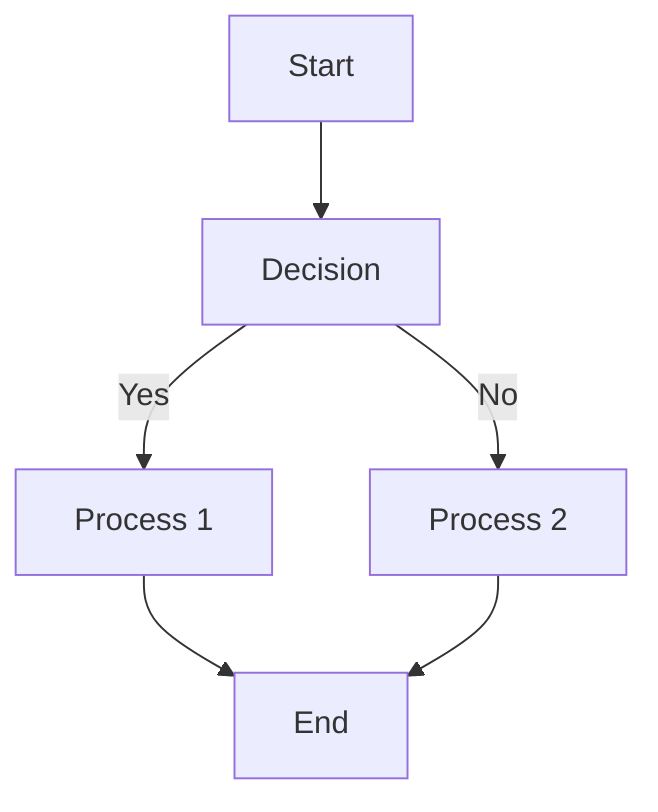
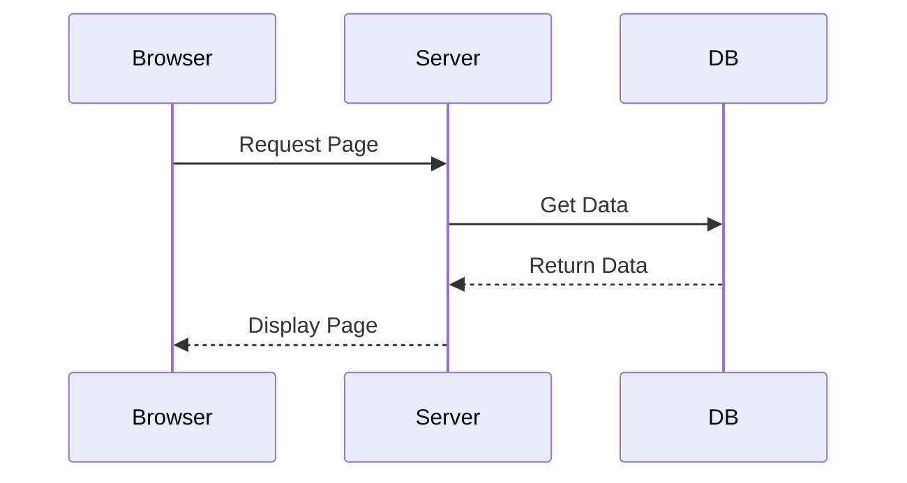

import { Image } from 'astro:assets';
import defaultImage from '~/assets/images/default.png';

# ダイアグラムテスト

## 画像テスト

<div class="my-8">
  <Image
    src={defaultImage}
    alt="Default image"
    width={800}
    height={400}
    quality={80}
    format="avif"
    loading="eager"
  />
</div>

## フローチャート（Mermaid）




## シーケンス図（Mermaid）

```mermaid
sequenceDiagram
  participant Browser
  participant Server
  participant DB
  
  Browser->>Server: Request Page
  Server->>DB: Get Data
  DB-->>Server: Return Data
  Server-->>Browser: Display Page
